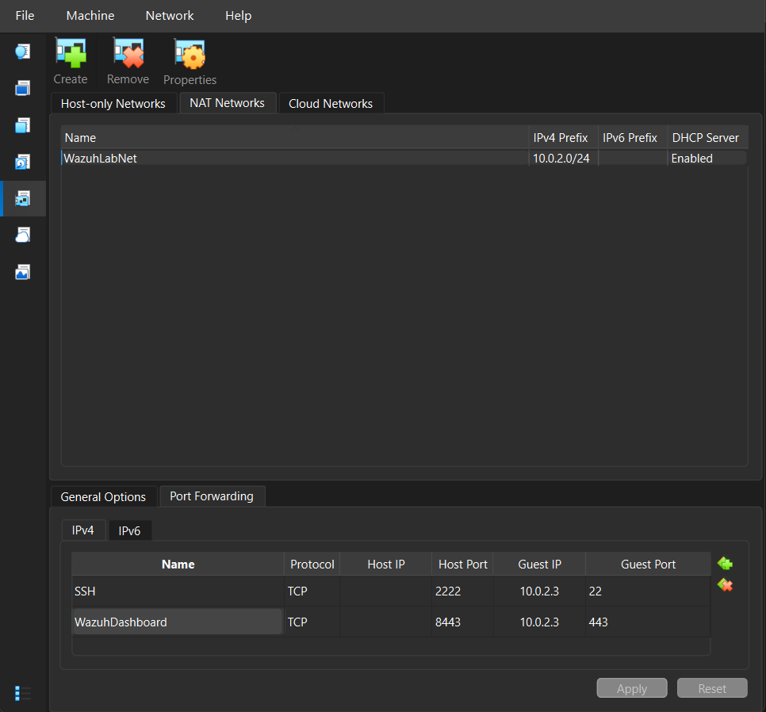
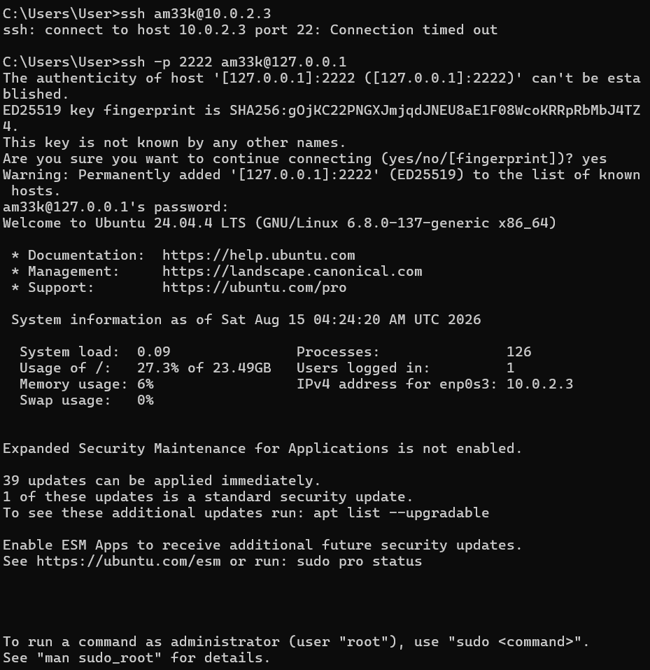
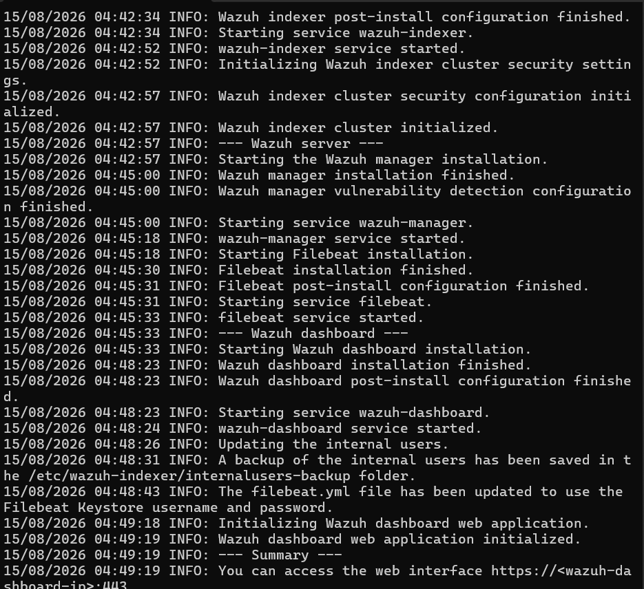
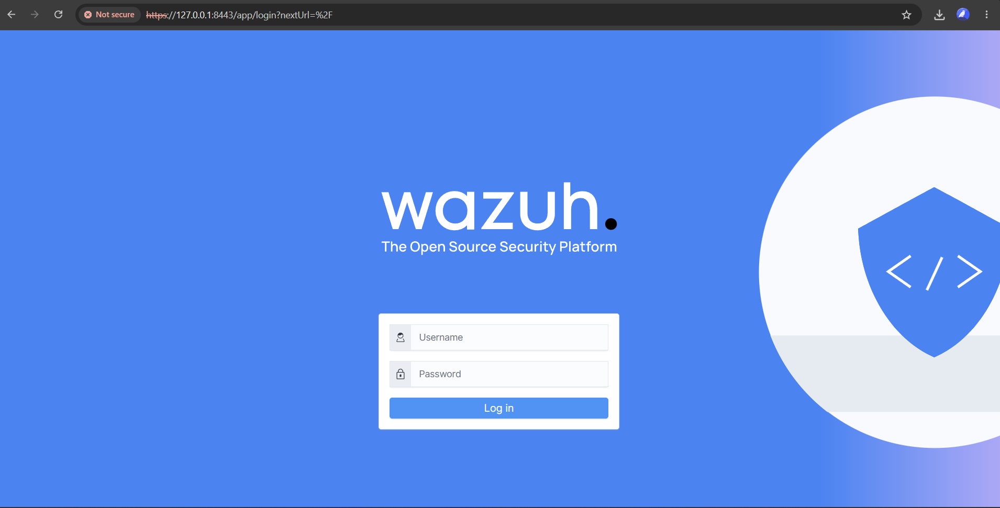
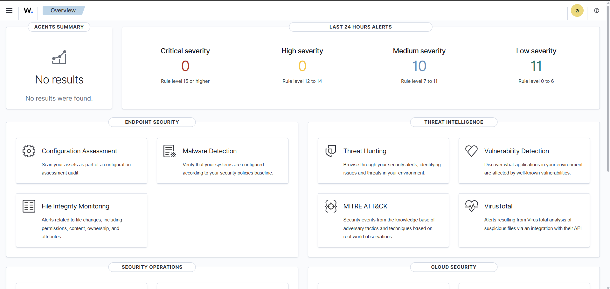

# Wazuh SIEM Home Lab — Build Notes

**Project goal:** Build a self-hosted SIEM home lab using Wazuh to practice log correlation, agent-manager architecture, detection logic, and Linux hardening — with network segmentation practiced via an isolated VirtualBox NAT Network rather than bridging to the home LAN.

**Environment:** VirtualBox, host running Windows, 16GB host RAM.

---

## Architecture Overview

- **Wazuh Manager** — central component that receives, correlates, and analyzes security data from all connected agents; also hosts the Wazuh Indexer (log storage/search, OpenSearch-based) and the Wazuh Dashboard (web UI).
- **Wazuh Agent** (planned next phase) — lightweight software installed on monitored endpoints; collects logs/events locally and forwards them to the Manager.
- This split mirrors real-world SOC architecture: detection/correlation logic is centralized so patterns *across* multiple machines can be identified, while agents stay lightweight and simply collect + forward.

---

## Network Design

Rather than bridging VMs onto the home LAN, all lab VMs sit on an isolated **VirtualBox NAT Network** (`WazuhLabNet`, subnet `10.0.2.0/24`).

**Why NAT Network over Bridged:**
- Bridged mode would place lab VMs directly on the home LAN with real, reachable IPs — exposing intentionally vulnerable/experimental services (and later, offensive security testing) to every other device on the home network.
- NAT Network provides outbound internet access (for package installs/updates) and lets lab VMs talk to each other, while remaining completely unreachable from the home LAN — genuine network segmentation, not just convenience.

**Static IP assignment:**
- Manager VM was moved off DHCP to a static IP (`10.0.2.3/24`, gateway `10.0.2.1`, DNS `8.8.8.8`) during OS install.
- Rationale: DHCP-assigned addresses can change between reboots/lease renewals. Since the Agent VM's config will hard-reference the Manager's IP, a floating address would silently break agent reporting after any DHCP reassignment.

**Remote access — SSH via port forwarding:**
- Host has no direct route into the isolated subnet (by design), so direct `ssh 10.0.2.3` and direct browser access to `10.0.2.3` both fail from the host.
- Fixed via explicit VirtualBox NAT Network port-forward rules (host → guest):
  - SSH: Host `2222` → Guest `10.0.2.3:22`
  - Wazuh Dashboard (HTTPS): Host `8443` → Guest `10.0.2.3:443`
- Access pattern from host: `ssh -p 2222 <user>@127.0.0.1` and `https://127.0.0.1:8443` — always targeting the host's own loopback address, since the forwarding rule (not a direct route) is what bridges into the isolated network.

---

## Build Steps Completed

### 1. Ubuntu Server 24.04 LTS install (Manager VM)
- Chose **Server** edition over Desktop: minimal footprint, no GUI/unnecessary services running — smaller attack surface (principle of least functionality) and lower resource usage.
- Chose **LTS** release: 5 years of security patching vs. ~9 months for standard releases — matters for a security tool that should run on a stable, continuously-patched base.
- VM specs (right-sized for 16GB host RAM, scaled down from a "recommended" 8GB spec to avoid starving the host and a future second VM): 4 vCPU, 4GB RAM, 50GB dynamically-allocated disk.
- Storage: LVM enabled (flexible resizing later); **LUKS disk encryption skipped** — deliberate decision, not an oversight. Threat model for a disposable/rebuildable lab VM on a personal machine doesn't justify the operational overhead of a boot-time passphrase; noted as a improvement I'd apply in an actual production context.
- OpenSSH server installed during setup; password authentication left enabled for now (simplicity trade-off) — **key-based SSH auth flagged as a follow-up hardening task.**

### 2. Wazuh all-in-one install
- Used Wazuh's official installer script (manager + indexer + dashboard on a single host — appropriate for lab scale; a real deployment would split these across dedicated hosts).
- Noted the general risk of piping remote scripts into `sudo bash` unseen — accepted here as a known, deliberate trust decision for an official vendor script, not a reflexive habit.
- Verified dashboard access at `https://127.0.0.1:8443` (self-signed cert — expected browser warning, since Wazuh's cert isn't signed by a publicly-trusted CA; this only affects identity verification, not the underlying encryption).
- Logged into dashboard successfully with generated admin credentials.

### 3. Checkpoint
- Took a VirtualBox snapshot (`Post-Install-Working`) immediately after confirming dashboard access — a known-good rollback point before making further changes.

---

## Concepts Reinforced

- Agent-manager architecture and why correlation logic is centralized
- CIDR notation / subnetting (`/24` = 254 usable hosts, `/28` = 14 usable hosts)
- VirtualBox networking modes: NAT vs. Bridged vs. Internal Network vs. NAT Network
- DHCP vs. static IP trade-offs for infrastructure that other systems depend on
- SSH fundamentals: password vs. key-based auth, the role of `sshd`
- Port forwarding as a controlled exception to network isolation
- TLS certificate trust vs. encryption (why self-signed certs trigger browser warnings)
- `sudo` (privilege elevation) vs. `apt update` (refresh package index) vs. `apt upgrade` (apply updates)

---

## Next Steps (Phase 2)

- [ ] Build second VM as Wazuh Agent, attach to `WazuhLabNet`
- [ ] Register agent with Manager, confirm it reports into the dashboard
- [ ] Enable File Integrity Monitoring (FIM)
- [ ] Enable vulnerability detection module
- [ ] Generate real test events and confirm detection
- [ ] Map at least one detected alert back to a MITRE ATT&CK technique
- [ ] Screenshot a real detected event as proof artifact
- [ ] (Stretch/hardening follow-up) Switch SSH to key-based authentication

---

## Screenshots

*Isolated NAT Network (`WazuhLabNet`, 10.0.2.0/24) with explicit port-forward rules — Host 2222 → Guest 22 (SSH) and Host 8443 → Guest 443 (Dashboard). No route exists from the host into this subnet except through these two deliberate rules.*

*Confirming the isolated network is reachable only through the configured port forward: `ssh -p 2222 am33k@127.0.0.1` from the host, routed through VirtualBox's NAT engine into the VM at 10.0.2.3:22.*

*Tail of the official Wazuh all-in-one installer script output, confirming the indexer, manager, and dashboard services all started successfully. (Credentials line cropped out before saving.)*

*Dashboard reachable at `https://127.0.0.1:8443` via the port-forward rule. Browser flags the connection as "Not secure" because Wazuh's TLS certificate is self-signed — expected for an internal lab tool, not a sign of broken encryption.*

*Initial dashboard state with zero agents connected. Notably, the Manager itself already generated 10 medium- and 11 low-severity alerts from its own baseline vulnerability/configuration checks — before any agent was ever added.*
